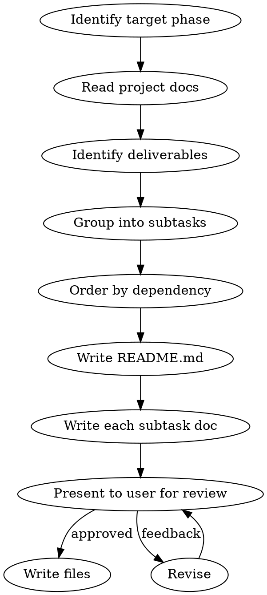

# Create Phase Subtask Documents

## Overview

Break down a flushdb implementation phase into ordered, detailed subtask documents following the established pattern in `docs/phases/foundation/`. Each subtask becomes its own markdown file with complete specifications — types, methods, wire formats, validation rules, tests, and acceptance criteria.

## Process



### 1. Read Project Context

Read ALL of these before decomposing:

- `docs/plan.md` — phase description, deliverables, and dependency table
- `docs/phases/phase-N-*.md` — the detailed phase document with sections, "Done when" criteria, and future work considerations
- `docs/PRD.md` — sections referenced by the phase (e.g., "PRD 5.1", "PRD 7.2")
- `docs/STORAGE_DESIGN.md` — storage internals referenced by the phase
- `docs/TESTING.md` — test patterns, categories, and requirements
- `CLAUDE.md` — hard rules, conventions, crate dependency graph
- **Existing code** — scan crate APIs, traits, and types that the phase builds on. Understand what interfaces already exist from prior phases.
- `docs/phases/foundation/` — read 3-4 example subtask docs to refresh on the exact format

### 2. Decompose into Subtasks

Rules for decomposition:

- **One coherent unit per subtask** — a type + its methods, a trait + its impl, a subsystem + its tests
- **Order by dependency** — foundational types/traits first, features that use them next, integration/wiring last
- **Group tightly coupled items** — types that make no sense alone ship together (e.g., a writer + its format)
- **Target 8-15 subtasks** for XL phases, 5-10 for L/M phases
- **Never create a subtask without testing requirements** — if you can't define tests, the subtask isn't well-defined enough
- **Read "Future Work Considerations"** in the phase doc — design interfaces with extension points for later phases

### 3. Create Directory and README

Create `docs/phases/<phase-name>/README.md` following this exact structure:

```markdown
# Phase N: [Name] — Subtask Breakdown

## Overview

[2-3 sentences: what this phase accomplishes and why it matters]

**Crates:** [list affected crates]
**Design references:** STORAGE_DESIGN.md §X, §Y

---

## Subtask Execution Order

Tasks are ordered by dependency — each task depends only on tasks above it.

| # | Subtask | File | Crate | Dependencies |
|---|---------|------|-------|-------------|
| 1 | [Name](./01-slug.md) | `file.rs` | crate-name | none |
| 2 | [Name](./02-slug.md) | `file.rs` | crate-name | task 1 |
...

---

## Acceptance Criteria (Phase-Level)

All of these must pass before Phase N is considered complete:

- [ ] `cargo build --workspace` succeeds with zero warnings
- [ ] `cargo test --workspace` — all tests pass
- [ ] `cargo clippy --workspace` — no warnings
- [ ] [Phase-specific invariants and integration checks]

---

## New Dependencies (Phase N)

| Crate | Version | Purpose |
|-------|---------|---------|
| ... | ... | ... |
```

### 4. Write Each Subtask Document

Every subtask document MUST follow this exact structure:

```markdown
# Task N: [Title] — [Subtitle]

**Crate:** `crate-name`
**File:** `src/module.rs` [or multiple files]
**Depends on:** Task X (reason), Task Y (reason) [or "Nothing"]
**Estimated complexity:** S | M | L
**Design reference:** STORAGE_DESIGN.md §X, PRD §Y

---

## Goal

[2-4 sentences: what this task accomplishes and why it's important in context]

---

## What to Build

### N.1 [First Component]

[Detailed specification]

### N.2 [Second Component]

[Detailed specification]

...

---

## Tests

**File:** `crates/{crate}/tests/{module}_tests.rs`

### [Test Category 1] (e.g., Round-trip Tests)
| Test | What It Validates |
|------|-------------------|
| `test_xxx` | Description |

### [Test Category 2] (e.g., Validation Tests)
| Test | What It Validates |
|------|-------------------|
| `test_yyy` | Description |

...

---

## Done When

- [ ] [Specific, verifiable acceptance criterion]
- [ ] [Another criterion]
- [ ] All tests pass
```

### 5. Subsection Patterns

Use these patterns within "What to Build" depending on what you're specifying:

**Type Definitions:**
- Struct/enum name, fields with types
- Derives list
- Design decisions as separate notes

**Constants:**
- Named constants with exact values
- Rationale for each value

**Methods (use tables):**
```markdown
| Method | Signature | Behavior |
|--------|-----------|----------|
| `name` | `(params) -> ReturnType` | Semantics, error handling, edge cases |
```

**Wire Format / Encoding:**
- Byte-layout diagram with offsets, sizes, fields
- Endianness specified explicitly (big-endian, little-endian)
- Discriminant values for enum variants
```markdown
**Binary format:**
\```
[offset 0..4]  length: u32 (big-endian)
[offset 4..8]  checksum: u32 (little-endian)
[offset 8..]   payload
\```
```

**Validation Rules (use tables):**
```markdown
| Check | Error |
|-------|-------|
| condition | `FlushError::Variant { field: "value" }` |
```

**Design Decisions:**
- Bullet points explaining non-obvious choices
- Why the decision matters (link to future phases, performance, correctness)

**Trait Does NOT Include:**
- When defining traits, explicitly list what is NOT part of the interface and why

### 6. Testing Specification Rules

Every subtask's test section must:

- Specify the exact test file path: `crates/{crate}/tests/{module}_tests.rs`
- Organize tests into categories (Round-trip, Sort Order, Validation, Edge Cases, Integration, etc.)
- Use table format: `| Test Name | What It Validates |`
- Name tests descriptively: `test_{module}_{behavior_being_tested}`
- Cover: happy path, error cases with specific error variant, edge cases, boundary conditions
- For I/O types: specify `tempdir` usage
- For concurrent behavior: specify concurrency test scenarios
- For encode/decode types: specify round-trip tests
- For ordered types: specify sort order equivalence tests
- Reference `docs/TESTING.md` patterns where applicable

### 7. Present to User Before Writing

**NEVER write subtask files without user approval.**

Present the full list first:

```
Phase N: [Name] — [count] subtasks

1. [Name] (complexity: S) — one-line summary
   Depends on: none

2. [Name] (complexity: M) — one-line summary
   Depends on: task 1

...
```

Then show each subtask's full content. Ask for approval. Revise based on feedback.

### 8. Write Files

After approval, create all files:

1. Create directory: `docs/phases/<phase-name>/`
2. Write `README.md`
3. Write each subtask as `NN-slug.md` (zero-padded two-digit number, kebab-case slug)

## File Naming Convention

- Directory: `docs/phases/<kebab-case-phase-name>/` (e.g., `wal`, `memtable`, `sstable`, `manifest-flush-read-compaction`, `caching`, `grpc-server`)
- README: `README.md`
- Subtasks: `01-slug.md`, `02-slug.md`, ..., `12-slug.md`
- Slug should be the primary type/component name in kebab-case

## Quality Checklist

Before presenting subtasks to the user, verify each document:

- [ ] **Header block** has all fields (Crate, File, Depends on, Estimated complexity, Design reference)
- [ ] **Goal** is 2-4 sentences explaining what and why
- [ ] **What to Build** has numbered subsections (N.1, N.2, ...) with the task number as prefix
- [ ] **Methods** use table format with Signature and Behavior columns
- [ ] **Wire formats** have byte-layout diagrams with endianness
- [ ] **Validation rules** use table format mapping checks to specific `FlushError` variants
- [ ] **Tests** specify exact file path, use category tables, and name every test
- [ ] **Done When** has specific checkboxes (not vague "it works")
- [ ] **Design references** cite STORAGE_DESIGN.md / PRD section numbers
- [ ] **No code blocks with full implementations** — specify behavior and contracts, not implementation code
- [ ] **Future-proofing** — interfaces leave seams for later phases where applicable
- [ ] **Error handling** specifies exact `FlushError` variants for each failure mode

## Common Mistakes

| Mistake | Fix |
|---------|-----|
| Subtask descriptions contain full implementation code | Describe WHAT to build and behavior contracts. Method signatures in tables are OK, function bodies are not. |
| Tests section says "add tests" without specifics | Name every test, organize by category, specify what each validates. |
| Missing dependency chain between subtasks | If subtask B uses types from subtask A, the header must say `Depends on: Task A (reason)`. |
| No wire format for persisted types | Any type that goes to disk/network must have a byte-layout diagram. |
| Validation rules without error variants | Every validation check must map to a specific `FlushError` variant with fields. |
| "Done When" repeats the goal | Acceptance criteria should be independently verifiable checks, not restatements. |
| Subsection numbering doesn't match task number | Task 5's subsections should be 5.1, 5.2, 5.3 — not 1, 2, 3. |
| No design reference in header | Every task must cite STORAGE_DESIGN.md or PRD sections it implements. |
| Tests in inline `#[cfg(test)]` blocks | Tests go in `crates/{crate}/tests/{module}_tests.rs` — external test files only. |
| Missing complexity estimate | Every task needs S/M/L estimate to help with planning. |

## Reference

- **Foundation example:** `docs/phases/foundation/` — the canonical reference for format and quality
- **Phase docs:** `docs/phases/phase-N-*.md` — source material for decomposition
- **Plan:** `docs/plan.md` — phase ordering and deliverables
- **Design:** `docs/STORAGE_DESIGN.md` — authoritative storage internals
- **Testing:** `docs/TESTING.md` — test patterns and requirements
- **Rules:** `CLAUDE.md` — hard rules and conventions
