# Three-Tier Cache

## Architecture

```mermaid
graph TD
    subgraph DRAM["DRAM Cache"]
        Window["Window (1%)&#10;LRU, admits all new entries"]
        Main["Main (99%)&#10;Protected (80%) + Probation&#10;Admitted only if freq >&#10;eviction candidate's freq"]
        Sketch["Frequency Sketch&#10;(Count-Min Sketch, halved periodically)"]
        Window -->|promote| Main
    end

    DRAM -->|evict| NVMe["NVMe (&lt;5ms)&#10;frequency check for admission"]
    NVMe -->|miss| S3["S3 (50-200ms)&#10;source of truth"]
```



**Cache key:** `(sstable_id, block_offset)` — one entry per 4 KB data block.

## Key Behaviors

**Pinned metadata:** Index blocks and bloom filters for live SSTables are pinned in DRAM permanently (<1% of SSTable size, accessed on every read). Swapped when compaction replaces SSTables.

**Continuity tracking:** After a full record scan (`match_all`) caches all blocks, the tracker records the range as complete. A subsequent point read for a missing key skips S3 entirely. Invalidated when compaction produces a new manifest for the affected range.

**Coalescing fetches:** Multiple adjacent block requests merge into a single S3 byte-range GET:

```
Without:  GET 4096-8191, GET 8192-12287, GET 12288-16383  (3 requests)
With:     GET 4096-16383                                    (1 request)
```

**GET budget:** Max 8 S3 GETs per read (configurable). Excess deferred with staleness flag.

**Compaction-aware eviction:** When compaction invalidates SSTables, their blocks are evicted asynchronously. Evictions to NVMe are skipped for compacted SSTables.

**Adaptive pagination:** First page estimates item count from cached avg item size. Actual avg stored in page token for subsequent pages. Server-side avg cache continuously updated per namespace.
