# Compaction

Compaction merges SSTables to reduce read amplification and reclaim tombstone space.

## Level Structure

```
                  Read amplification
                  (max SSTables checked per point read)
                        │
  L0   [A] [B] [C] [D] │ 4   ← may overlap, all checked
       ────────────────►│     ← flush lands here
           4 files max  │
                        │
  L1   [═══F═══][═══G═══] 1   ← non-overlapping, binary search
           256 MB max   │
                        │
  L2   [════H════][════I════][════J════]  1  ← non-overlapping
            2.56 GB max │
                        │
  L3   [═══════K═══════][═══════L═══════] 1  ← non-overlapping, tombstone GC
            25.6 GB max │
                        │
       ─────────────────┘
       Total: at most 4 + 1 + 1 + 1 = 7 SSTables per point read
       (bloom filters eliminate most of these)
```

## Leveled Strategy (10x size ratio)

| Level | Max | Trigger | Action |
|-------|-----|---------|--------|
| L0 | 4 files | Overflow | All L0 → overlapping L1 |
| L1 | 256 MB | Overflow | One L1 file → overlapping L2 |
| L2 | 2.56 GB | Overflow | One L2 file → overlapping L3 |
| L3 | 25.6 GB | Timer (1h) | Drop expired tombstones |

## Write Stalling

| L0 Count | Effect |
|----------|--------|
| ≤ 4 | Normal. Compaction triggered. |
| 5–8 | Throttled. Each write sleeps `(count - 4) × 1ms`. |
| 9–12 | Stalled. `RESOURCE_EXHAUSTED` with `retry-after`. |

## Merge Process

```mermaid
graph TD
    subgraph L0["L0 Input"]
        A["A: keys a-m"]
        B["B: keys d-z"]
        C["C: keys a-f"]
        D["D: keys k-p"]
    end

    A & B & C & D --> Merge["Merge-sort by key&#10;Dedup by sequence&#10;Drop dead tombstones"]

    Merge --> F0["frag-0000&#10;keys a-h"]
    Merge --> F1["frag-0001&#10;keys i-p"]
    Merge --> F2["frag-0002&#10;keys q-z"]

    subgraph L1["L1 Output (each ~1 GB, own bloom + index + footer)"]
        F0
        F1
        F2
    end

    L1 --> CAS["CAS manifest:&#10;remove A,B,C,D from L0&#10;add frag-0000..0002 to L1"]
    CAS --> DEL["Deferred DELETE of A,B,C,D&#10;(after no active readers hold old manifest)"]
```



## SSTable Run Fragments

Compaction output is a **run** of smaller fragments, not a monolith:

```
sstables/L1/run-{id}/frag-0000.sst
sstables/L1/run-{id}/frag-0001.sst
sstables/L1/run-{id}/frag-0002.sst
```

Max temporary space = `2 × fragment_size` instead of `2 × total_run_size`.

**Trivial move:** If a fragment's key range doesn't overlap the next level, it's "moved" by manifest-only update — zero S3 I/O. For time-ordered keys, most compactions are trivial moves.

## Tombstone Lifecycle

```mermaid
graph TD
    W["Write: DeleteItems"] --> WAL --> Memtable --> L0
    L0 -->|"L1 compaction"| L1["Covered PUTs dropped&#10;Tombstone survives —&#10;older PUTs may exist below"]
    L1 -->|"L2 compaction"| L2["Same"]
    L2 -->|"L3 (bottom level)"| L3["Tombstone TTL checked&#10;Expired (7d + random 0-24h jitter)&#10;→ dropped"]
```



Range tombstones use a watermark protocol: only eligible for deletion when all levels below have been compacted past the tombstone's creation timestamp.
