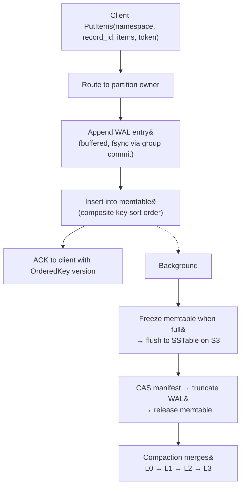
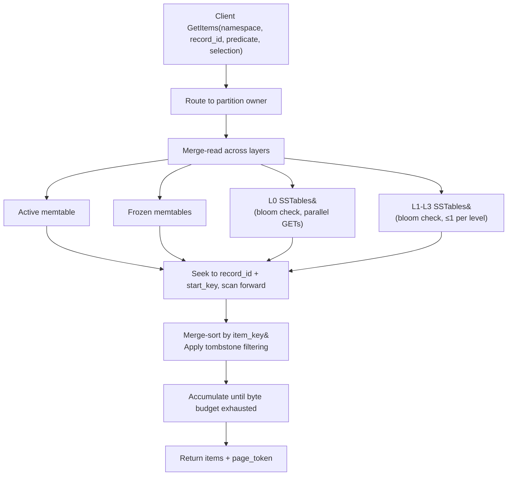
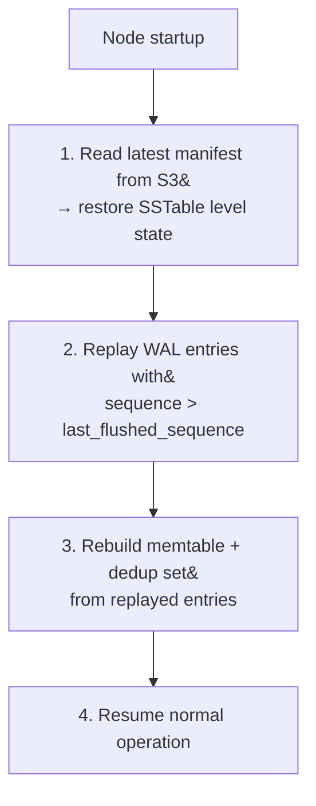

# End-to-End Data Flow

## Write

```mermaid
graph TD
    A["Client PutItems(namespace, record_id, items, token)"] --> B["Route to partition owner"]
    B --> C["Append WAL entry&#10;(buffered, fsync via group commit)"]
    C --> D["Insert into memtable&#10;(composite key sort order)"]
    D --> E["ACK to client with OrderedKey version"]
    D -.-> F["Background"]
    F --> G["Freeze memtable when full&#10;→ flush to SSTable on S3"]
    G --> H["CAS manifest → truncate WAL&#10;→ release memtable"]
    H --> I["Compaction merges&#10;L0 → L1 → L2 → L3"]
```

## Read

```mermaid
graph TD
    A["Client GetItems(namespace, record_id, predicate, selection)"] --> B["Route to partition owner"]
    B --> C["Merge-read across layers"]
    C --> C1["Active memtable"]
    C --> C2["Frozen memtables"]
    C --> C3["L0 SSTables&#10;(bloom check, parallel GETs)"]
    C --> C4["L1-L3 SSTables&#10;(bloom check, ≤1 per level)"]
    C1 & C2 & C3 & C4 --> D["Seek to record_id + start_key, scan forward"]
    D --> E["Merge-sort by item_key&#10;Apply tombstone filtering"]
    E --> F["Accumulate until byte budget exhausted"]
    F --> G["Return items + page_token"]
```

## Recovery

```mermaid
graph TD
    A["Node startup"] --> B["1. Read latest manifest from S3&#10;→ restore SSTable level state"]
    B --> C["2. Replay WAL entries with&#10;sequence > last_flushed_sequence"]
    C --> D["3. Rebuild memtable + dedup set&#10;from replayed entries"]
    D --> E["4. Resume normal operation"]
```

Zero data loss for ACK'd writes, assuming the WAL survived the crash.
