# Flush Pipeline

The complete sequence from frozen memtable to durable S3 state.

## Flow

```mermaid
graph TD
    FM["Frozen Memtable&#10;(sorted entries)"] -->|iterate in sort order| BB["Block Builder&#10;4KB blocks, compress, CRC"]

    BB --> SST["sstables/L0/{ulid}.sst"]
    BB -->|record_ids| BF["Bloom Filter"]
    BB -->|first_keys| IDX["Index Block"]
    BB -->|tokens| DDP["Dedup Block"]
    BF & IDX & DDP --> SST
    FTR["Footer"] --> SST

    SST --> CAS["CAS: v(N+1)&#10;If-None-Match: *"]

    subgraph Manifest["manifests/"]
        MAN["v42.json (add L0)"]
    end
    CAS --> MAN

    CAS -->|on success| Cleanup
    subgraph Cleanup["Cleanup"]
        TRUNC["Truncate WAL segments"]
        REL["Release frozen arena&#10;(O(1) drop)"]
    end

    Cleanup -->|"if L0 > 4 files"| COMP["Schedule compaction"]
```

## Failure Modes

| Crash Point | S3 State | Recovery |
|-------------|----------|----------|
| During build | Unchanged | WAL replay rebuilds memtable |
| During upload | Incomplete multipart | S3 lifecycle aborts it. WAL replay. |
| During CAS | SSTable on S3, not in manifest | Orphan GC deletes it. WAL replay. |
| After CAS, before WAL cleanup | Manifest updated, WAL intact | WAL replay is idempotent |

**The WAL is the safety net. The manifest CAS is the commit point.**
