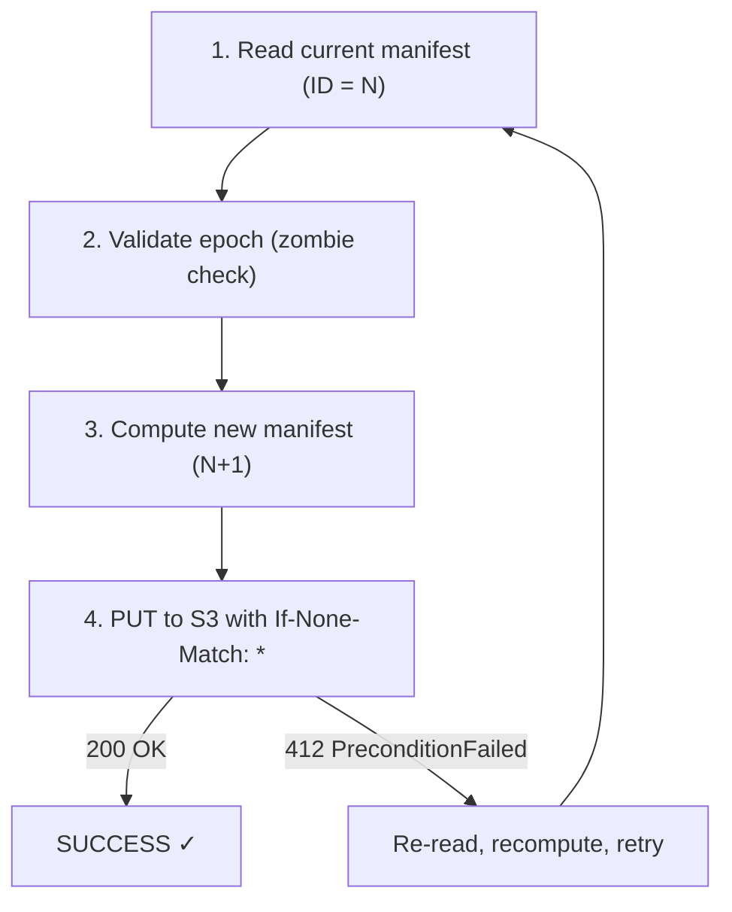
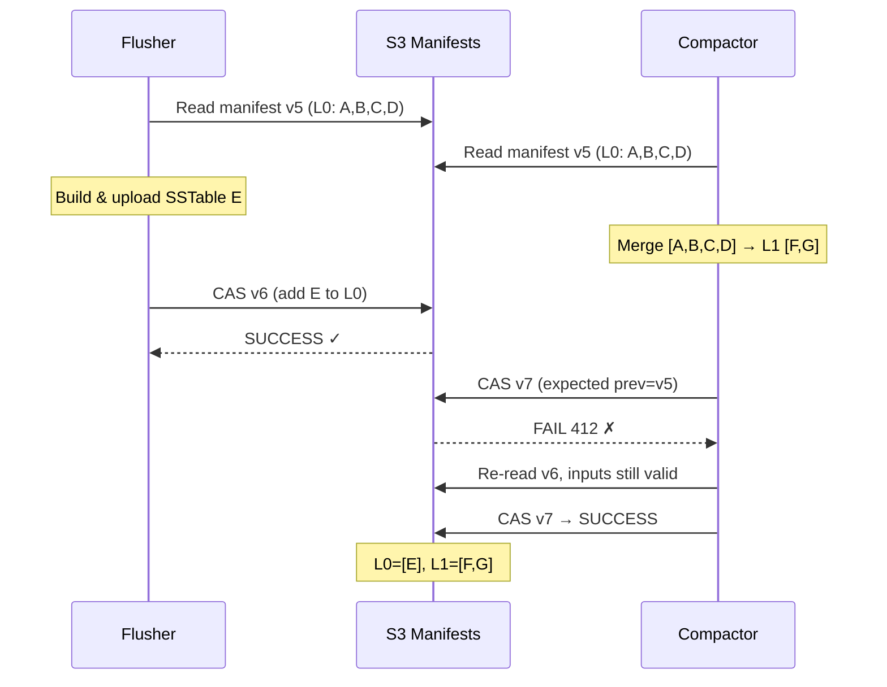
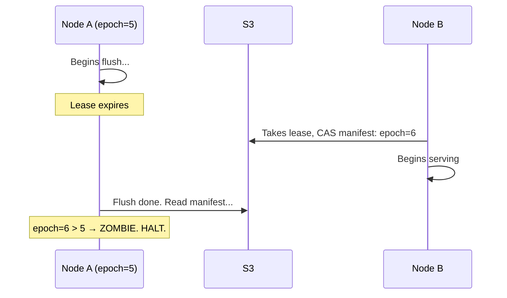

# Manifest

The manifest defines which SSTables are live at each level. It is the **commit point** for all state changes.

## Role in the System

```mermaid
graph TD
    V42["v42.json (CURRENT)&#10;writer_epoch: 7 · compactor_epoch: 3&#10;last_flushed_sequence: 458923"]

    V42 -->|L0| SstE["sst-E.sst ✓"]
    V42 -->|L1| RunFG["run-FG/frag-0, frag-1 ✓"]
    OLD["sst-OLD.sst ✗&#10;(GC candidate)"]

    Startup["On startup"] -.->|read manifest| V42
    Flush["On flush"] -.->|"CAS: add L0 SSTable"| V42
    Compact["On compact"] -.->|"CAS: remove inputs, add outputs"| V42
    Recovery["On recovery"] -.->|"replay WAL > last_flushed_seq"| V42
```



## Structure

```json
{
  "format_version": 1,
  "manifest_id": "00000000000000000042",
  "writer_epoch": 7,
  "compactor_epoch": 3,
  "namespace": "my-namespace",
  "last_flushed_sequence": 458923,
  "levels": {
    "L0": [{ "id", "size_bytes", "entry_count", "min_key", "max_key",
             "bloom_filter_offset", "bloom_filter_size",
             "sequence_range", "record_id_count", ... }],
    "L1": [...], "L2": [], "L3": []
  },
  "tombstone_compaction_watermarks": { "L1": ..., "L2": ... },
  "previous_manifest_id": "00000000000000000041"
}
```

**Manifest IDs** are 20-digit zero-padded integers. The highest ID is always the current manifest — S3 `ListObjectsV2` gives you the latest. Two writers computing the same next ID race: one wins, the other retries.

**S3 path:** `s3://{bucket}/{hash % 128}/flushdb/{namespace}/manifests/{id}`

## CAS Update Protocol

Every flush, compaction, and GC operation updates the manifest atomically:



S3 conditional writes reject a PUT if the key already exists. No external coordination needed.

## Concurrent Flush + Compaction



## Epoch-Based Fencing

**Problem:** Node A begins flushing, its lease expires, Node B takes over, A's flush completes and tries to update the manifest.

**Solution:** Each manifest carries `writer_epoch` and `compactor_epoch`. On lease acquisition, the new owner bumps the epoch. The old node's writes are rejected:



## Snapshots and Pruning

Every 100 versions, a self-contained **snapshot manifest** is written. On startup, read the latest snapshot and apply subsequent deltas. Versions older than the second-most-recent snapshot are eligible for deletion.

A **pointer file** (`manifest.json`) provides fast lookup of the current manifest ID. Falls back to `ListObjectsV2` if stale.
