# Memtable

The memtable buffers writes in-memory before they are flushed to SSTables on S3.

## Lifecycle

```mermaid
graph TD
    subgraph ReadPath["Read Path (checks all)"]
        Active["Active Memtable"]
        F1["Frozen 1 (flushing)"]
        F2["Frozen 2 (queued)"]
    end

    Writes["Writes"] --> Active
    Active -->|"≥ 64 MB or 5 min"| F1
    F1 --> Build["Iterate frozen in sort order&#10;→ build SSTable"]
    Build --> Upload["Upload to S3"]
    Upload --> CAS["CAS manifest"]
    CAS --> Release["Release frozen arena&#10;(O(1) drop)"]

    BP["⚠ Backpressure: 3 frozen memtables&#10;→ writes rejected RESOURCE_EXHAUSTED"]
```



## Skip List

```
Level 3:  HEAD ──────────────────────────────────► 47 ────────────────► NIL
Level 2:  HEAD ──────────► 12 ──────────────────► 47 ────────────────► NIL
Level 1:  HEAD ──────────► 12 ────► 25 ──────────► 47 ──► 53 ────────► NIL
Level 0:  HEAD ──► 3 ──► 12 ──► 19 ──► 25 ──► 31 ──► 47 ──► 53 ──► 61 ► NIL
```

O(log n) insert, lookup, and iteration. Max height 12 (supports ~4 billion entries). Probability 1/4 per level.

Since this is shard-per-core, the owning core is the sole writer — inserts are plain pointer writes with no CAS or locking.

Each entry stores:

```rust
MemtableEntry {
    composite_key:    Bytes,            // [record_id][0x00][item_key]
    value:            Bytes,
    metadata:         Bytes,
    idempotency_key:  IdempotencyToken, // dedup during unflushed window
    sequence_number:  u64,              // WAL sequence for ordering
    entry_type:       EntryType,        // PUT | DELETE | RANGE_DELETE
}
```

## Arena Allocator

Each memtable owns a bump allocator backed by 1 MB blocks:

```rust
Arena {
    blocks: Vec<Box<[u8; 1_048_576]>>,
    current_offset: usize,
    total_allocated: usize,
}
```

Thousands of skip list node allocations become pointer bumps. Cache locality improves because nodes are contiguous. Deallocation is O(1) — drop all blocks when the memtable is released after flush. No atomics needed (single-owner).

## Freeze and Swap

When `total_allocated >= 64 MB` or 5 minutes elapse:

1. **Swap** the active memtable pointer with a new empty memtable.
2. The old memtable becomes **frozen** — pushed onto a read-only list, still checked during reads.
3. A background flush task is notified.

If 3 frozen memtables accumulate (flush can't keep up), writes are rejected — 192 MB is the ceiling.

## Range Tombstone Index

A secondary index for range deletes, sorted by `(record_id, start_key)`:

```rust
RangeTombstone {
    record_id: Bytes,
    start_key: Bytes,       // inclusive
    end_key: Bytes,          // exclusive
    sequence_number: u64,
}
```

During point reads, this index determines if a key falls within a range tombstone with a higher sequence number. If so, the entry is dead.

## Idempotency Dedup

Each memtable maintains a `HashSet` of idempotency tokens. On write: check active + frozen sets. If found, skip (already applied). Tokens are flushed into the SSTable's dedup block and expire after 10 minutes.
