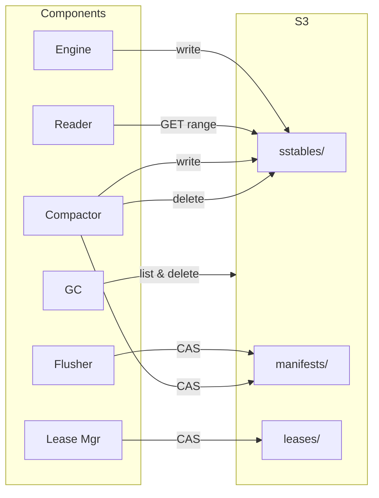

# S3 Storage Layer

S3 serves three roles: durable storage for data (SSTables, blobs), coordination layer (manifests, leases), and garbage collection target.



## Object Layout

```
s3://{bucket}/{hash(id) % 128}/flushdb/{namespace}/
  ├── manifests/          00000000000000000001.json, ...
  ├── sstables/
  │   ├── L0/             {ulid}.sst
  │   ├── L1/             {run-id}/frag-0000.sst, ...
  │   ├── L2/             ...
  │   └── L3/             ...
  ├── blobs/              {blob-id}.blob
  ├── chunks/             {chunk-group-id}/chunk-0000, ...
  └── leases/             partition-{id}/lease-{version}.json
```

**128-way prefix sharding** avoids S3 partition throttling. SSTable IDs are ULIDs (time-sortable, hash-distributable).

## Conditional Writes

S3 `If-None-Match: *` (available since August 2024) is the coordination primitive. Used for manifest CAS and lease acquisition. No external coordination service needed.

## Distributed Leases

Partition ownership via versioned S3 lease keys:

```
  leases/partition-0/
    lease-00000000000000000001.json  ← expired (Node A, old)
    lease-00000000000000000002.json  ← expired (Node A, renewed)
    lease-00000000000000000003.json  ← CURRENT (Node B, took over)
                                       {owner: B, epoch: 6, expires: T+30s}

  Acquisition:
    Node C ──► ListObjects(leases/partition-0/)
           ──► Sees lease-03 expired
           ──► PUT lease-04 with If-None-Match: *
           ──► 200 OK → Node C owns partition 0
                412 → someone else won, re-list and retry

  Renewal (every 10s):
    Node C ──► PUT lease-05 with If-None-Match: *
           ──► Delete lease-01, lease-02 (old)
```

30-second TTL, 10-second renewal interval (three chances before expiry).

## Large Value Handling

| Value Size | Strategy |
|-----------|----------|
| < 32 KB | Inline in SSTable |
| 32 KB – 4 MB | **Value separation**: blob object on S3, SSTable holds `(blob_id, offset, size)` pointer. Compaction rewrites only pointers, not data. Write amplification drops from 10-30x to ~1x. |
| ≥ 4 MB | **Chunked**: split into 4 MB S3 objects, fetched in parallel (up to 32 concurrent GETs). |

The separation threshold is adaptive — adjusted based on observed write amplification and read patterns.

## Garbage Collection

| What | When Garbage | How |
|------|-------------|-----|
| SSTables | Compaction removes from manifest | Reference tracking → deferred DELETE after no active readers hold the old manifest version |
| Orphans | Crash during flush | List objects not in manifest, delete after 1 hour |
| Manifests | After 100+ newer versions | Delete beyond 2-snapshot retention |
| Blobs | Live ratio < 50% | Rewrite live entries, pointer migration during compaction |
| Chunks | Referencing entry removed | Scan references, delete orphans after 4h grace |
| Multipart uploads | Crash during upload | S3 lifecycle rule (24h) |

SSTable GC protocol: each reader holds a manifest version reference. GC only deletes SSTables removed in versions older than the minimum active reader version. 30-minute timeout for stuck readers.
