# Write-Ahead Log (WAL)

The WAL ensures durability for writes that haven't yet been flushed to S3.

## Lifecycle

```mermaid
graph TD
    CW["Client Write"] --> WB["WAL Buffer (in-memory)"]
    WB -->|"200μs / 256KB&#10;group commit"| FS["fsync()"]
    FS -->|confirmed| ACK["ACK Client"]
    WB -->|appended to| SEG["WAL Segments (local disk)&#10;segment-01: all flushed → DELETE&#10;segment-02: gen 4 active&#10;segment-03: current append"]
    SEG -->|on memtable flush| SST["SSTable on S3 (L0)"]
    SST -->|"CAS manifest confirmed"| SAFE["Segment safe to delete&#10;(dirty map empty)"]
```



## Segment Architecture

The WAL is a sequence of fixed-size **segments** (default 32 MB) on local disk.

```
wal/partition-{id}/
    segment-000000000001.wal    ← oldest active
    segment-000000000002.wal
    segment-000000000003.wal    ← current append target
```

Segments are deleted whole after a flush confirms data on S3 — no mid-file truncation. Segment numbers are monotonically increasing 12-digit zero-padded integers. Gaps from deleted segments are normal.

## Entry Wire Format

Each entry is length-prefixed and CRC-protected:

```
┌─────────────────────────────────────────────────────┐
│ entry_length: uint32 (little-endian)                │  4 bytes
├─────────────────────────────────────────────────────┤
│ sequence_number: uint64 (little-endian)             │  8 bytes
│ entry_type: uint8 (0=PUT, 1=DELETE, 2=RANGE_DELETE) │  1 byte
│ namespace_len: uint16                               │  2 bytes
│ namespace: bytes                                    │  variable
│ record_id_len: uint16                               │  2 bytes
│ record_id: bytes                                    │  variable
│ item_key_len: uint16                                │  2 bytes
│ item_key: bytes                                     │  variable
│ item_value_len: uint32                              │  4 bytes
│ item_value: bytes                                   │  variable
│ item_metadata_len: uint16                           │  2 bytes
│ item_metadata: bytes                                │  variable
│ idempotency_token: bytes                            │  24 bytes
├─────────────────────────────────────────────────────┤
│ crc32: uint32 (over all preceding bytes)            │  4 bytes
└─────────────────────────────────────────────────────┘
```

**Recovery:** Read `entry_length`, read payload + CRC, validate. CRC failure at segment tail = partial write from crash (safe to discard). CRC failure mid-segment = corruption (halt and alert).

## Group Commit

Individual fsync per write is expensive. The WAL batches writes:


Writes are appended to a buffer and inserted into the memtable immediately but **not ACK'd** until the buffer is fsynced. Every 200μs or 256KB (whichever comes first), the batch is fsynced and all writes in it are ACK'd simultaneously. Under sustained load, hundreds of writes share a single fsync — **5-10x throughput improvement**.

The commit interval is configurable down to 50μs for latency-sensitive namespaces.

Two fsync modes per namespace:

| Mode | Behavior | Durability | Latency |
|------|----------|------------|---------|
| `SYNC` (default) | fsync after every batch | Survives power loss | ~0.5-2ms |
| `BATCH_SYNC` | fsync on 10ms timer | May lose last 10ms | ~50-100μs |

## Dirty Segment Tracking

A segment cannot be deleted until **all** memtable generations that wrote to it have been flushed to S3. Each segment maintains:

```
dirty_map: HashMap<memtable_generation_id, highest_sequence>
```

When generation G is flushed: remove G from all segments' dirty maps. If a segment's map becomes empty, it's safe to delete.

**Low-write partitions** may never fill a memtable, pinning segments indefinitely. Two pressure valves:
- **Age trigger:** Segments pinned > 5 minutes → force-flush referencing memtables.
- **Size trigger:** Total WAL > 512 MB → force-flush the oldest pinned memtable.

**Backpressure:** WAL > 256 MB (4x memtable threshold) → writes stalled with `RESOURCE_EXHAUSTED` until a flush completes.
